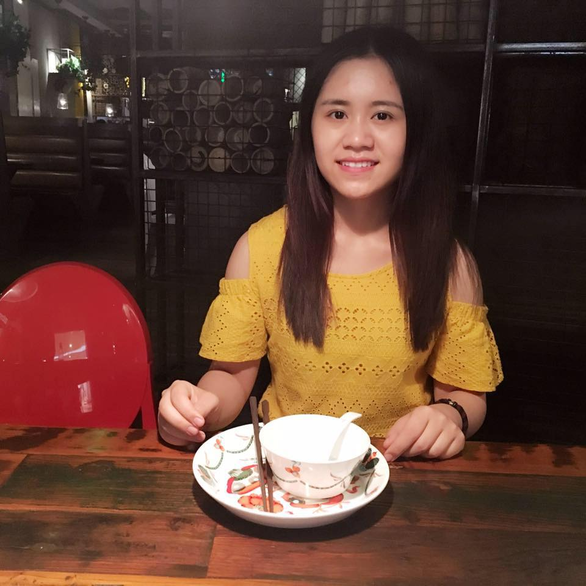

<link rel="stylesheet" type="text/css" href="image.css">

    

## Bio
**Xiaoyu Liu** is heading for being a Software Engineer!

Xiaoyu was a Deep Learning Researcher at [**AltumView System Inc.**][1] from 2017.11 to 2019.04. She graduated as a Computing Science master student from **Simon Fraser University** (2015.09 - 2017.08), supervised by [Prof. Greg Mori](https://www.cs.sfu.ca/~mori/). And she earned her Bachelor’s degrees in Engineering from **University of Science and Technology of China** (2011.09 - 2015.06). 

## Program Languages
- C/C++
- Python
- Java
- JavaScript
- HTML/CSS
- Matlab
- SQL

## Interests
- Hiking
- Cooking
- Singing

## *Speciality :D*

**Experience in sleeping in**: Bus(*Proficient*), SkyTrain/Subtrain: (*Skilled*), Flight: (*Experienced*)

[1]: http://www.altumview.com/